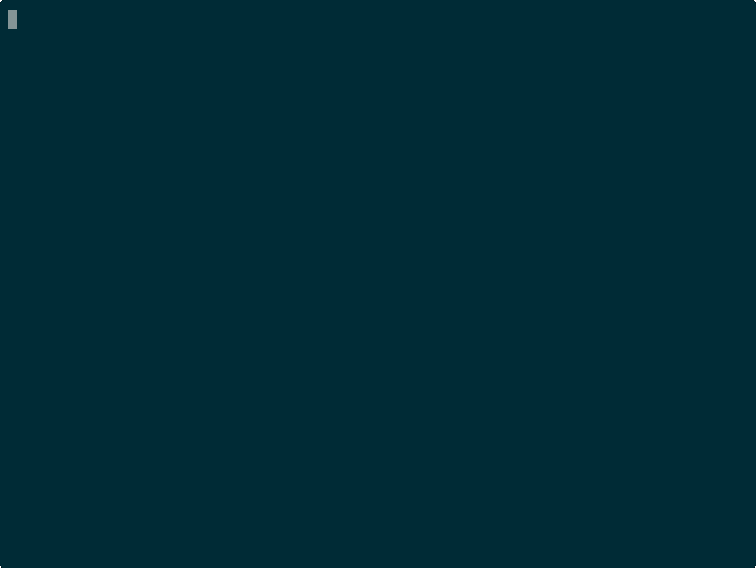

<div align="center">

# lovagentic

**Agentic CLI for [Lovable.dev](https://lovable.dev) — agents in, apps out.**

Send prompts, verify builds, fix errors, and publish — straight from your terminal or from inside your AI agent.

[](https://www.npmjs.com/package/lovagentic)
[](https://www.npmjs.com/package/lovagentic)
[](https://github.com/Alfridus1/lovagentic/actions/workflows/ci.yml)
[](./LICENSE)
[](https://lovagentic.com/docs)

</div>

---

```bash
npm install -g lovagentic
lovagentic prompt "https://lovable.dev/projects/YOUR-ID" "Add a dark mode toggle"
```

That's it. Lovable builds. You ship.



---

## What it does

lovagentic gives your terminal and AI agents operator-grade control over common Lovable workflows:

| | |
|---|---|
| 🚀 **Prompt** | Send prompts, split long ones automatically, verify they landed |
| 🔍 **Verify** | Screenshot every route, check for layout overflows, assert text |
| 📦 **Publish** | One command to deploy — with live URL check |
| 🛠 **Fix** | Inspect runtime errors, click "Try to fix", loop until clean |
| 🤖 **Agent-ready** | JSON output on automation-focused commands. Pipe it, script it, chain it. |

---

## Multi-backend: API first, browser fallback

lovagentic v0.2 auto-selects the most durable available backend per command:

```
LOVABLE_API_KEY set  →  @lovable.dev/sdk preview backend where supported
Lovable session      →  Playwright browser backend for UI-only surfaces
LOVABLE_MCP_URL set  →  reserved for a future public MCP backend
```

Lovable's public docs currently describe the Lovable API as starting with
**Build with URL**. The key-backed SDK backend in lovagentic is intentionally
treated as a preview path: use it when Lovable has granted API access, and keep
the browser backend as the compatibility layer for UI-only surfaces.

The MCP transport is intentionally scaffolded, not production-active. If an MCP
endpoint is configured today and cannot satisfy the requested capabilities,
lovagentic falls back to the browser backend in `auto` mode.

Set an API key and supported commands can skip Playwright:

```bash
export LOVABLE_API_KEY=lov_your_key_here
lovagentic api --validate        # confirm SDK/API access
lovagentic list --json           # pure HTTPS, instant
lovagentic prompt "..." "..."    # no browser launch
```

---

## Install

```bash
npm install -g lovagentic
```

First run:

```bash
lovagentic doctor          # check environment
lovagentic login           # authenticate with Lovable (browser, one-time)
lovagentic list            # confirm projects are visible
```

---

## Quick examples

**Send a prompt and verify it landed:**
```bash
lovagentic prompt "https://lovable.dev/projects/YOUR-ID" \
  "Make the hero section full-width on mobile" \
  --headless --seed-desktop-session --verify-effect
```

**Scaffold a project directory:**
```bash
mkdir my-app && cd my-app
lovagentic init --project-url https://lovable.dev/projects/YOUR-ID
```

**Publish to production:**
```bash
lovagentic publish "https://lovable.dev/projects/YOUR-ID" \
  --headless --seed-desktop-session --verify-live
```

**Screenshot all routes (desktop + mobile):**
```bash
lovagentic verify "https://lovable.dev/projects/YOUR-ID" \
  --route / --route /docs --route /pricing \
  --expect-text "Get started" \
  --meta-description "Agentic CLI"
```

**Confirm a published site is actually updated:**
```bash
lovagentic publish-confirm "https://lovable.dev/projects/YOUR-ID" \
  --expect-text "API-first where supported" \
  --forbid-html "Browser-based today, native MCP next week"
```

**Check any public site without a Lovable session:**
```bash
lovagentic site-check https://lovagentic.com \
  --discover-routes \
  --expect-link github.com/Alfridus1/lovagentic
```

**Expose repo docs to Lovable as an MCP connector:**
```bash
LOVAGENTIC_MCP_TOKEN=change-me lovagentic mcp-server \
  --host 0.0.0.0 --port 8787
```

**Run a repeatable build plan:**
```yaml
# runbook.yaml
projectUrl: https://lovable.dev/projects/YOUR-ID
steps:
  - type: snapshot
  - type: prompt
    promptFile: ./prompts/feature.md
  - type: verify
    expectText: [Feature, Get started]
  - type: publish
    verifyLive: true
```
```bash
LOVABLE_API_KEY=lov_... lovagentic runbook ./runbook.yaml
```

---

## All commands

| Command | What it does |
|---|---|
| `init` | Scaffold a project directory |
| `doctor` | Check local environment + network |
| `api` | Validate SDK/API-key readiness |
| `mcp-server` | Read-only MCP server for repo docs, commands, issues, releases |
| `login` | Authenticate with Lovable |
| `list` | List your projects |
| `create` | Create a new Lovable project |
| `prompt` | Send a prompt |
| `mode` | Switch build/plan mode |
| `wait-for-idle` | Wait until Lovable stops thinking |
| `verify` | Screenshot routes; check text, title, meta, links, HTML, layout |
| `publish` | Publish / deploy |
| `publish-confirm` | Publish and poll live assertions until the custom domain is fresh |
| `site-check` | Check a public site with screenshots, HTML recordings, meta/link assertions |
| `route-discover` | Discover same-origin routes from nav/header/sidebar links |
| `update-site` | Prompt a Lovable site update from an audit file and verify it |
| `project-sync-status` | Inspect Git, latest edit, publish state, and preview/live drift |
| `status` | Read project metadata |
| `code` | Read repo files via Lovable |
| `snapshot` | API-backed project artifact |
| `diff` | API-backed git diff |
| `runbook` | Execute a YAML/JSON build plan |
| `knowledge` | Read/write project knowledge |
| `domain` | Manage custom domains |
| `speed` | Lighthouse audit |
| `fidelity-loop` | Iterative verify → fix loop |
| `chat-loop` | Prompt → actions → verify |
| `errors` | Inspect + click runtime errors |
| `findings` | Read security findings |

Full command reference → [docs/commands.md](./docs/commands.md)

`site-check`, `publish-confirm`, and `update-site` write an `audit-bundle.json` next to their screenshots and HTML snapshots. The bundle keeps assertions, console/page errors, failed requests, prompt turns, and publish confirmation evidence together for agent handoff.

---

## Agent-ready: pipe it, script it

Most automation and read-heavy commands support `--json`:

```bash
STATUS=$(lovagentic status "https://lovable.dev/projects/YOUR-ID" --json)
EDIT_COUNT=$(echo $STATUS | jq '.editCount')

lovagentic prompt "..." "Add a pricing table" --json | jq '.effect.confirmed'

lovagentic publish "..." --json | jq '.liveUrl'
```

Commands that exist mainly to open or repair local browser state, such as
`login` and `import-desktop-session`, stay human-facing by design.

Use it from Claude, GPT, Codex, or any agent that can run shell commands.

---

## Environment variables

| Variable | Effect |
|---|---|
| `LOVABLE_API_KEY` | Use SDK/API backend where available |
| `LOVABLE_BEARER_TOKEN` | Alternative API auth |
| `LOVABLE_MCP_URL` | Reserved for the planned MCP backend |
| `LOVABLE_PROJECT_URL` | Default project for commands |
| `LOVAGENTIC_PROFILE_DIR` | Custom browser profile path |

---

## Requirements

- Node.js 20+
- A Lovable account + session
- Playwright Chromium for browser-backed flows (`npx playwright install chromium`; `doctor --self-heal` can repair it)
- Optional: `LOVABLE_API_KEY` to use SDK-backed flows where available

---

## Roadmap

| Version | Status | What |
|---|---|---|
| **v0.1** | ✅ shipped | Browser-first CLI — Playwright control of every Lovable surface |
| **v0.2** | ✅ shipped | Multi-backend — SDK/API preview + browser fallback, MCP scaffold |
| **v0.3** | 🔵 planned | CI/CD integrations (GitHub Actions, Vercel workflows) |
| **v0.4** | ⚪ exploratory | Team-scale hosted control plane |

---

## Development

```bash
npm test          # regression tests
npm run check     # syntax + tests
npm run doctor    # environment check
```

📚 Full docs: **[lovagentic.com/docs](https://lovagentic.com/docs)**  
📦 npm: **[npmjs.com/package/lovagentic](https://www.npmjs.com/package/lovagentic)**  
🐛 Issues: **[github.com/Alfridus1/lovagentic/issues](https://github.com/Alfridus1/lovagentic/issues)**

MIT License
